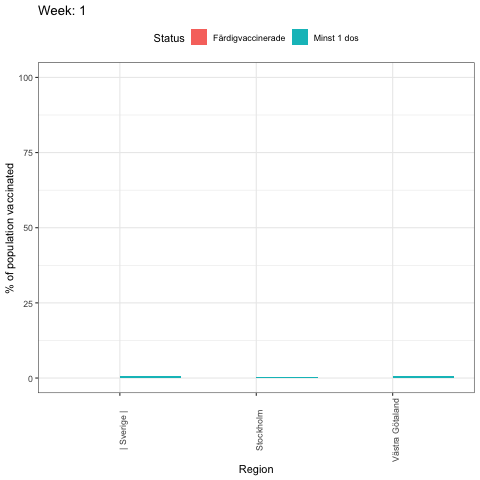
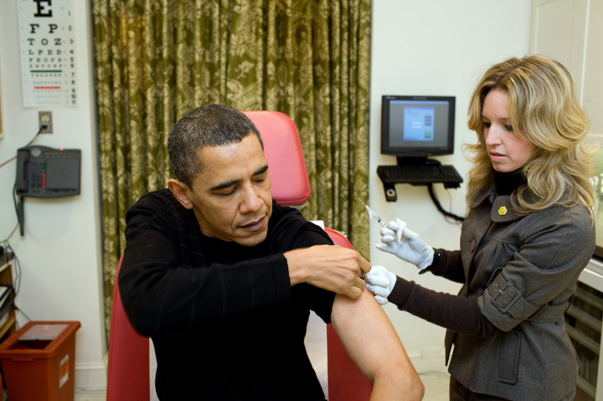

## R Project: Covid-19 Vaccination tracker

This page explains the Covid-19 Vaccination process both in [Sweden](https://github.com/pablo-ferro/Covid_Sweden_vaccination_gganimate) and [Spain](https://github.com/pablo-ferro/Covid_Spain_vaccination_gganimate) and try to set up the comparison structure and formatting for the coming future, as this is a work in progress. Quite fun to tell the story of a project building.

### Introduction

The main goal with this project is to highlight some positive data from this situation and understand the differences between two countries.

Using R for the first time was a challenge that quickly turned into a animated chart to visualize how the rate was trying to reaching the desired 70% of population vaccinated:

How fast vaccination rates grew in such different European countries like Spain and Sweden? And if we look at the two main regions in each country?

If you liked this project and are interested in many others that I developed, check these ones:
- 🕺🎧 Spotify Python API top tracks: [Spotipy most listened songs](https://github.com/pablo-ferro/Spotify_API_top_tracks)
- 🌸🌼 Machine Learning Iris classification: [Iris Flower classification](https://github.com/pablo-ferro/ML_iris_flower)
- 🗣👍🏽 Natural Language Programming NLP Project: [Joe Biden speech Sentiment Analysis](https://github.com/pablo-ferro/NLP_Biden_speech)
- 🧗🏻‍♀️🗺 Mapping special caves in Cannary Island: [Cartographic coordinates dynamic map]( https://github.com/pablo-ferro/mapping_Caves_in_CanaryIslands)
- 👨🏻‍🚀👋🏼 Python API Introduction [International Space Station](https://github.com/pablo-ferro/International_Space_Station_API)

Connect with me: [LinkedIn](https://www.linkedin.com/in/pablo-ferro/)
